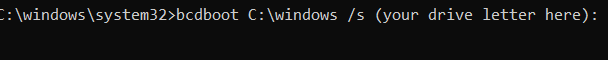

# Transfer/Create Windows Boot Manager on Other Disk

Have you ever run into the problem where the Windows Installer was stupid, and it installed your actual Windows installation on your main drive/SSD, but it installed the boot manager on to another HDD/SSD, and without that other drive, Windows won't boot?
<br>Some guides say to save all the files that you can and reinstall Windows. **No.** This is *not the solution*. You don't need to reinstall windows to transfer the bootloader to your main drive.

#### Simply follow the steps below:

1. Go to Windows Search and find `"Create and format hard disk partitions"` and open it. This will open Control Panel, where you can edit disk partitions.
1. Next, go to your ```C:``` drive and see if your drive has unallocated space (it has a black bar above it).
    1. If it doesn't
        1. Right click on the main ```C:``` NTFS Partition and click ```Shrink Volume...```
        1. Before continuing, <ins>make sure you have enough space on the main partition. Don't get your files deleted!</ins>
        1. In the editable box ```Enter the amount of space to shrink in MB```, shrink the partition by 100-200 MB. You can choose what you'd like.
        1. You should now see some unallocated space with a black bar above it. Right click it and click ```New Simple Volume...```. Don't change any of the settings, make the partition take up all the unallocated space.
        1. Then, give the partition a drive letter, preferably one that's high in the alphabet so it's unlikely to be picked up and used by software or confused. Don't worry, we'll delete the drive letter later.
        1. Format the partition as ```FAT32``` and change the label to UEFI or EFI. Click ```Next >``` and ```Finish```, and the partition will be created.
    1. If it does
        1. Great! Right click the unallocated space (with a black bar above it) and click ```New Simple Volume...``` Make the partition take up about 100-200 MB. You can choose what you'd like.
        1. Then, give the partition a drive letter, preferably one that's high in the alphabet so it's unlikely to be picked up and used by software or confused. Don't worry, we'll delete the drive letter later.
        1. Format the partition as ```FAT32``` and change the label to UEFI or EFI. Click ```Next >``` and ```Finish```, and the partition will be created.
1. Alright, we've got an EFI partition! Now, run Command Prompt as an Administrator.
1. Type in
```bcdboot C:\windows /s (your drive letter here):```
<br><br>**Make sure you include the : at the end!**
1. It should say ```Boot files successfully created.``` If it does, great! But we're not finished yet.
1. Unmount the drive from Windows:
    1. Open `"Create and format hard disk partitions"` again
    1. Right click the EFI partition and click ```Change Drive Letter and Paths...```
    1. Remove the drive letter and click OK.
1. In Command Prompt, open diskpart by simply running `diskpart`
1. Type in `list disk` and select your boot disk by then typing in `select disk=(disk number here)`
1. Type in `list partition` and select the EFI partition (which should be 100-200MB, check in "Create and format hard disk partitions" for verification if needed) by typing in `select partition=(partition number here)`
1. Pay attention to this one. Type in `SET ID=c12a7328-f81f-11d2-ba4b-00a0c93ec93b`
    1. If "Create and format disk partitions" is open, then you should see the partition name disappear.
1. Run `list partition` again to make sure your partition is now labeled as a "`System`" partition type.
    1. If so, great!
1. Finally, shut down, unplug the drive that the old Windows Boot Manager was on, and power on to see if it boots.  If it does, *that's it!* You've created a new EFI boot partition on your main drive. You can now safely remove the other drive.

### That's it! You're all done.

<center>
<br><br><br><br><br><br>go to <a href="https://bananaplays.com">my website</a>
<br><br><br><br><br><br><br><br><br><br><br><br><br><br><br><br><br><br>yes i used markdown for this page because i'm lazy and it looks nice
</center>